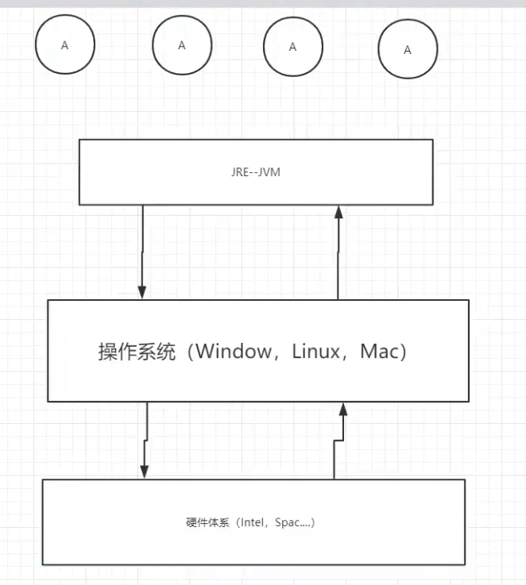

# JVM探究

- 请你谈谈你对JVM的理解？java8虚拟机和之前的变化更新？
- 什么是OOM？什么是栈溢出StockOverFlowError？怎么分析？
- JVM的常用调优参数有那些？
- 内存快照如何抓取？怎么分析Dump文件？知道吗？
- 谈谈JVM中，类加载器你的认识？

# 1、jVM的位置

1. JVM的体系结构
2. 类加载器
3. 双亲委派机制
4. 沙箱安全机制
5. Native
6. PC寄存器
7. 方法区
8. 栈
9. 三种JVM
10. 堆
11. 新生区，老年区
12. 永久区
13. 堆内存调优
14. GC
    1. 常用算法
15. JMM
16. 总结